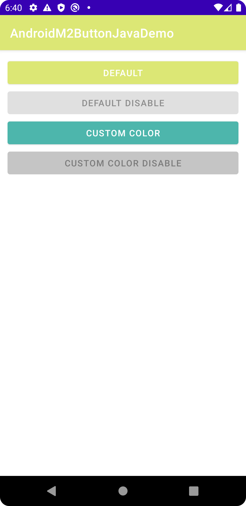
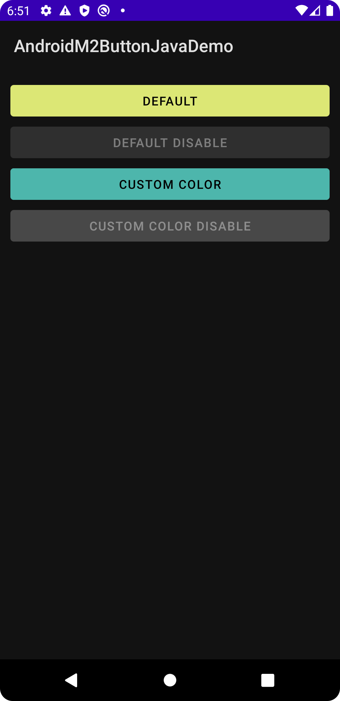

# キャプチャ ピクセル 3a API 29 (OS version 10)

| light theme | dark |
----|--
|  |  |

# Button color customize (only light theme)

## 手順１：自分の好きな色を定義する

color.xmlに以下のような感じでカラーコードを定義する 
https://github.com/LeoAndo/AndroidM2ButtonJavaDemo/blob/master/app/src/main/res/values/colors.xml#L11-L12

## 手順２：アプリで使うボタンの色を一括で変更する方法

https://github.com/LeoAndo/AndroidM2ButtonJavaDemo/blob/master/app/src/main/res/values/themes.xml#L5

## 手順３：部分的にボタンの色を変える方法

- resディレクトリの下にcolorディレクトリを作成する
    - https://github.com/LeoAndo/AndroidM2ButtonJavaDemo/tree/master/app/src/main/res/color
- colorディレクトリの中にselectorファイルを追加する
    - https://github.com/LeoAndo/AndroidM2ButtonJavaDemo/blob/master/app/src/main/res/color/my_btn_bg_color_selector.xml
- selectorファイルをButton側で利用する
    - https://github.com/LeoAndo/AndroidM2ButtonJavaDemo/blob/master/app/src/main/res/layout/activity_main.xml#L25        
